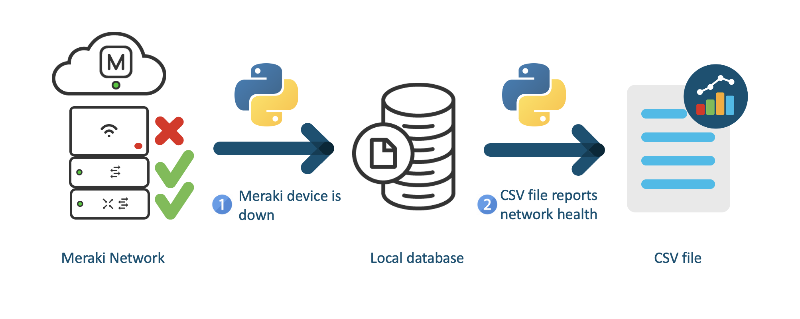

# Meraki SLA Reporting

An application utilizing Meraki Dashboard APIs to monitor the Meraki devices in an organization and write a wireless health report based on the uptime of those devices. If a device goes down, the application tracks the total downtime of the device and factors that downtime into the overall health of the network.



## Contacts
* Danielle Stacy (dastacy@cisco.com)

## Solution Components
* Meraki Dashboard API
* SQLite
* Python 3.9

## Prerequisites
- **Meraki Dashboard APIs**: Enable API access in the Meraki dashboard following [these steps](https://documentation.meraki.com/General_Administration/Other_Topics/Cisco_Meraki_Dashboard_API#Enable_API_Access). Generate an API key as described in the instructions and note it down. It will be used later.

## Installation/Configuration
1. Clone this repository with `git clone https://github.com/gve-sw/gve_devnet_meraki_sla_reporting` and open the directory.
2. Add the API key to the meraki.py file. `api_key = "enter API key here"`
3. Set up a Python virtual environment. Make sure Python 3 is installed in your environment, and if not, you may download Python [here](https://www.python.org/downloads). Once Python 3 is installed in your environment, you can activate the virtual environment with the instructions found [here](https://docs.python.org/3/tutorial/venv.html).
4. Install the requirements with `pip install -r requirements.txt`
5. The database and its tables need to be created before the prototype can be run. To set up the database, run the command `python3 db.py`

## Database
The database has three different tables: site, device, and status. The site table keeps track of the Meraki networks and has columns for the network id and network name. The device table keeps track of all the Meraki network devices and has columns for the device mac address, device name, device model, network id for the network the device is in. The status table keeps track of the times the network devices are offline. It has columns for a unique identifier for each downtime, the start time of when the device first registered as offline, the end time of when the device first registered as back online, and the mac address of the device the status is associated with.

## Usage
The functions that monitor the devices and write the report can be found in report.py. The scheduler function is in main.py. 

Currently, the code is set up to monitor the Meraki devices every 2 minutes and the report is written every 4 weeks. To change the schedule times, change the code written on lines 20-22 in main.py. The scheduled time for the getTime function should always match the scheduled time for the writeReport function.

```python
schedule.every(2).minutes.do(monitorDevices, down_devices)
schedule.every(4).weeks.do(writeReport, down_devices, start_time)
schedule.every(4).weeks.do(getTime, start_time)
```

To learn more about the schedule python module, read the [documentation](https://schedule.readthedocs.io/en/stable/index.html). You can also find [examples](https://schedule.readthedocs.io/en/stable/examples.html#run-a-job-every-x-minute) of the different intervals you can schedule the jobs to run at.

To run the code, run the command `python3 main.py`

The CSV report is saved in a file named sla_report.csv. Each row of the CSV file lists the name of the network, the percent uptime of the MX devices in the network, the percent uptime of the MS devices in the network, and the percent uptime of the MR devices in the network. 

# Screenshots


Output of the program while it monitors the Meraki devices


Example of the CSV report file


### LICENSE

Provided under Cisco Sample Code License, for details see [LICENSE](LICENSE.md)

### CODE_OF_CONDUCT

Our code of conduct is available [here](CODE_OF_CONDUCT.md)

### CONTRIBUTING

See our contributing guidelines [here](CONTRIBUTING.md)

#### DISCLAIMER:
<b>Please note:</b> This script is meant for demo purposes only. All tools/ scripts in this repo are released for use "AS IS" without any warranties of any kind, including, but not limited to their installation, use, or performance. Any use of these scripts and tools is at your own risk. There is no guarantee that they have been through thorough testing in a comparable environment and we are not responsible for any damage or data loss incurred with their use.
You are responsible for reviewing and testing any scripts you run thoroughly before use in any non-testing environment.
